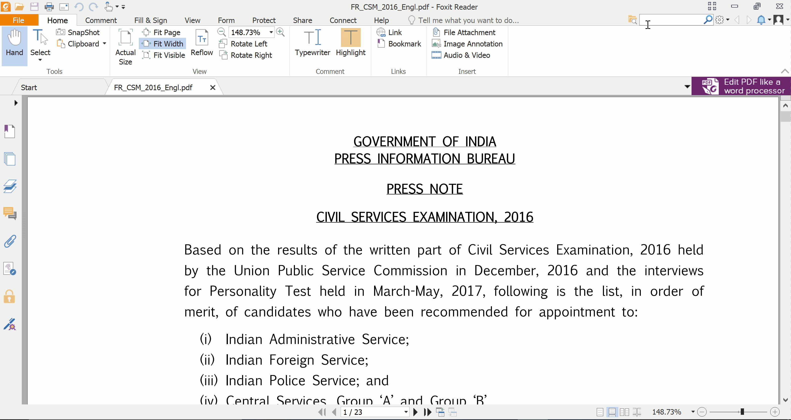

Month & Year: May 2017

Location: Singapore

Chandni had completed the personal interview a few days back,  the final round of the civil services examination. This was her third attempt and second interview. She was at her home in Kerala, and I was in my hostel room in National University of Singapore. There was a sudden chatter in various aspirants' groups that the results were going to be announced that night. Although her house is barely 10 km away from the magnificent Cochin International Airport, the mobile internet connectivity at her house sucked. There was no broadband or fibre internet connection either at that point. I stationed myself in front of my laptop, refreshing the UPSC website continuously and furiously, trying not to think about the last time I checked her results. 

> > In 2015, when I was asked by her to check the results of the preliminary examination, I had to deliver the bad news that she hadn't cleared. I didn't want a repeat of that. 

Suddenly I noticed a change in the website. A new PDF has been uploaded! Downloaded it, opened it, and hit Ctrl+F and typed `Chandni`. 

.

.

.

It's difficult to explain in words how I was feeling throughout this. My heart was racing, hands fidgety as I tried to figure out if she cleared it or not. There's not even a second between hitting Ctrl+F and finding out if her name figured in the list. However, it felt like an eternity. I didn't want her to go through the exam process once again. 

.

.

.

`1 result found!`

Immediately, I called her up and conveyed the good news. I couldn't speak to her again that night as her phone was constantly buzzing. It was already past 10 p.m. in Singapore by the time the results were out. I was in my hostel room, thousands of kilometres away, wondering how to celebrate. I went out for a walk in the campus, got a few cokes from a vending machines, and watched comedies till 2 a.m. 

### The next dilemma

Once the euphoria of the results die down, practicalities come to mind. Which service and which cadre is she going to get? And how will I manage my own career along with that. Based on her rank and previous trends, she could get either the Indian Administrative Service or the Indian Foreign Service. What was it gonna be? May be I'll write about that in the next post of this new series - `Tales from the travelling husband`!

