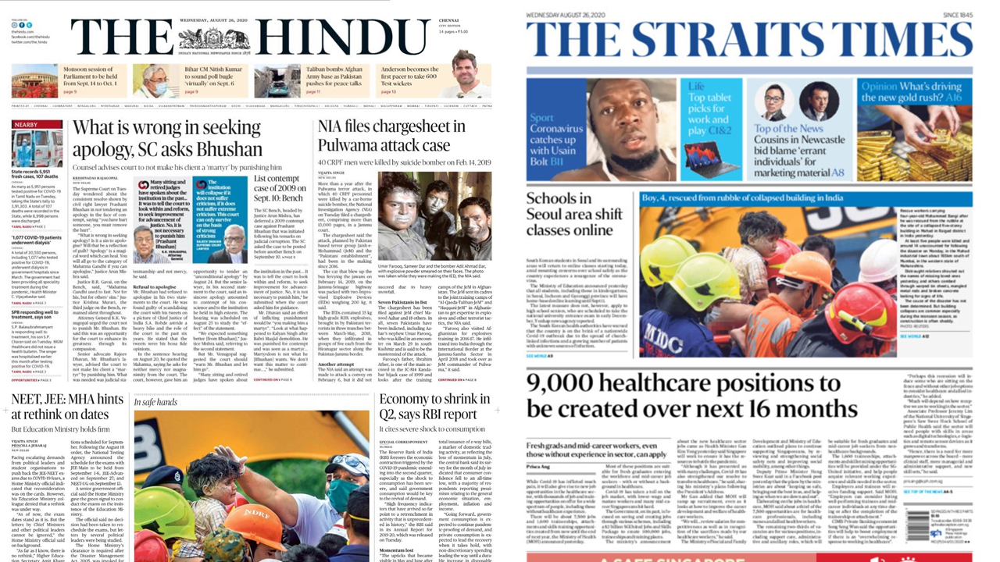
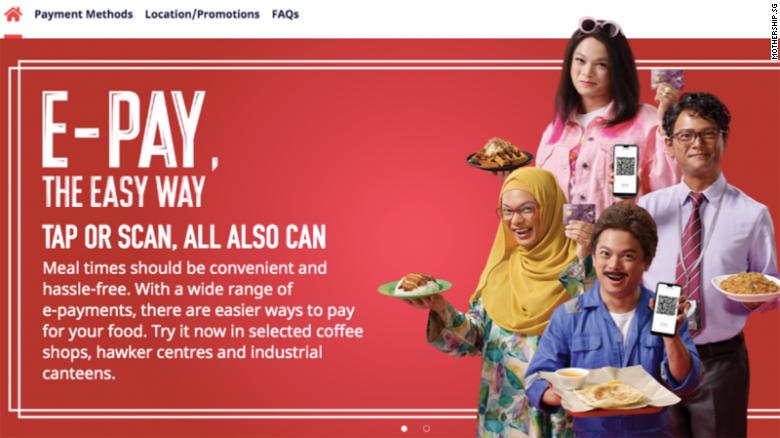

A week ago, I wrote the [following](https://arunsudarsan.in/post/free-speech/). 

> India is a dangerous country to exercise our rights of free speech. It’s dangerous because it’s not just the fanatical groups that want to obliterate you, it’s the government systems as well. It’s dangerous because the protections are applied unequally. It’s dangerous because of the ingrained social inequality. Meanwhile, the *guardian angel* has been scandalized by a tweet and is on vacation.

Today morning, as I write this post, and look back at my time in Singapore, I wonder if we should be _okay_ giving up a few of our rights for a better quality of life. I can confidently say that the quality of life of an average Singaporean is much higher than the average Indian. Government has instilled sense of discipline and loyalty (to the party, government and the country), and in return, ensured that their lives are as frictionless as possible. 

### 3 years of comfort

From mid-2015 to early 2018, I had a _comfortable_ life in Singapore. The streets were clean, public transportation was excellent, and air quality was the best I'd experienced. Part of the reason - I was a student earning a healthy stipend (funded by the Singaporean tax payers), and had nothing else to worry about except turning in my assignments, and doing well in exams. 

### Estate No. 3$\frac{3}{4}$ 

In Singapore, I continued my habit of reading [newspapers daily](https://arunsudarsan.in/post/support-newspapers/). The staple diet was [The Straits Times](https://www.straitstimes.com/global). Take a look at today's headlines in The Straits Times and The Hindu.

> August 26, 2020
>
> > The Hindu: "What is wrong in seeking apology, SC asks Bhushan"
> >
> > The Straits Times: "9,000 healthcare positions to be created over next 16 months"

 

In fact, The Straits Times is a _boring_ newspaper. While Malaysian politics is covered in great detail, there's hardly any political news about the ruling People's Action Party or the (nominal) opposition by the Worker's Party. Is it because of [government interference](https://en.wikipedia.org/wiki/The_Straits_Times#Government_interference) in the newsroom? (Spoiler alert: Yes). There's no criticism of the government, unless by design. 

### Freedom of Speech

Singapore is a multiracial country - 76.2% of the population is Chinese, followed by Malay (15%) and Indians (7.4%). Freedom of speech is severely curtailed through official laws, and through self censorship. Take this controversy as an example. 

Last year, an ad was put out to promote digital payments, featuring the Chinese Actor Dennis Chew, in which he darkened his skin to portray different races in Singapore. 

While the ad was eventually taken down after the controversy, two Indian rappers and YouTubers, siblings Preeti Nair and Subhas Nair produced a rap video in response to the controversy.

<iframe width="560" height="315" src="https://www.youtube.com/embed/en3C4paSpBY" frameborder="0" allow="accelerometer; autoplay; encrypted-media; gyroscope; picture-in-picture" allowfullscreen></iframe>

Response?

1. The video was [blocked](https://www.reuters.com/article/us-singapore-socialmedia/social-media-sites-block-satirical-rap-video-in-singapore-after-government-complaint-idUSKCN1US0K8) 
2. Preeti and Subhas had to issue [unconditional apology](https://www.channelnewsasia.com/news/singapore/preetipls-subhas-nair-unconditionally-apologise-for-rap-video-11778560)  (after their initial [_mock, insincere_ apology](https://mothership.sg/2019/08/mha-preetipls-subhas-apology-rap-video/)) 
3. The duo were given a [conditional warning](https://www.todayonline.com/singapore/siblings-behind-controversial-rap-video-given-conditional-warning-police) 

Question for us: Would our country be much better if people just stopped abusing each other online or offline? If the government strictly controlled our speech online? 

### False Choice?

Sure, we can always point to countries with near absolute freedom of expression and better quality of life. So may be I'm not asking the right question. Is it _Freedom v/s Quality of Life_? Or is it a more fundamental question - are countries with homogeneous or near-homogenous population more likely to have better quality of life and more freedoms than countries with heterogeneous population? Is diversity bad for us?  

