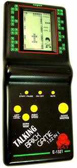

Year 1999. 

I was a student in Christ Nagar School, 10 km away from home. I didn't get admission in Loyola School, half km the previous two attempts (UKG and Class I), so yeah, stuck with early morning bus rides with a load of books. 

Throughout my school and college life, I've never been the most studious person in the class. Always above average or good,  but never the best. My parents were also _chill_, because I was mostly an obedient student, caused almost no trouble at home or school, and teachers liked me. 

Which bring me back to Class III. At the beginning of each term (equivalent to a new semester), the _class teacher_ announces the names of 3 students who topped the final exams of the previous term. This time, after Onam exams, our class teacher came in which the _big marks-register_, looked at all of our puppy dog eyes, and read the three names. 

Rank 1: Abhijit Senan[^*]

Rank 2: Sonia Rajan[^*]

Rank 3: Arun Sudarsan :open_mouth:

Yaaaaaaay! In Christ Nagar, it was a BIG DEAL to be one among the Top 3 in these exams. We get a gold star :star: that we can pin on our tie until the next term exam. We get to keep it if we still figure in the Top 3. Give it up if we fall off the podium :pensive:. 

That evening, I got off the bus excitedly at Sreekaryam junction and rushed to my father, who was waiting in front of Shaju bakery. 

> അച്ഛാ! എനിക്ക് തേർഡ് റാങ്ക് കിട്ടി! ഇനി ഗോൾഡ് സ്റ്റാർ കിട്ടുമല്ലോ! 

> `Dad, I got third rank! I'll get a gold star`

He was happy, and asked me what I wanted. I've always wanted to buy one of these handheld games (I can't remember the name! :see_no_evil:). He got it from me from a nearby shop for 150 rupees! (At 8% constant inflation, that'd be approximately 800 rupees now :stuck_out_tongue_winking_eye: ) 

### Countdown to Gold Star Day

The Gold Star is pinned to your tie by the Principal, in front of the entire school, during the first assembly of the term. I was counting down to the day eagerly. 3 days before the event, I was asked to take my school diary and visit the maths teacher. My classmate Pranay[^*] also accompanied me to the staff room with his school diary. We entered the staff room and met with the maths teacher. 

> "There was a calculation error. Both of your ranks have to be changed", she said.

She took our school diaries from us, checked the _big marks register_, and opened my diary. I watched nervously as she changed my rank from ~~3~~ to 4 :fearful: and Pranay's from ~~8~~ to 3!

| No   | Exam           | Marks | Rank    |
| ---- | -------------- | ----- | ------- |
| 1    | Onam Term Exam | 567   | ~~3~~ 4 |

### The Dam Broke

I walked back to the classroom, holding back my tears. I wish I was in Class V or above - I still would've gotten a silver star. As soon as I sat down back in my seat, I broke down! Tears rolled down my eyes and I started wailing quite loudly, only for the super sweet Malayalam teacher to comfort me. Somehow I made it through the rest of the day.

**On the bus ride home, I kept wondering - would I have to return the gift?**

_The End_

[^*]: Names changed because I don't remember them :wink: