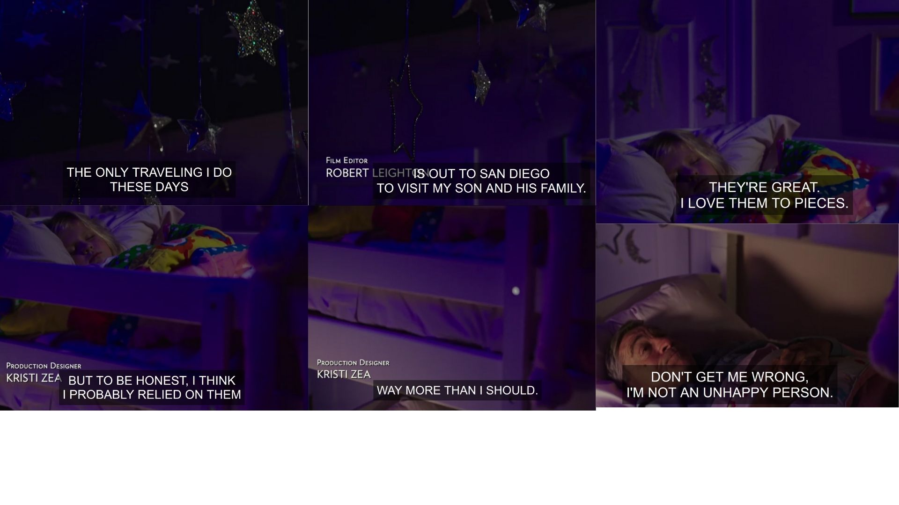
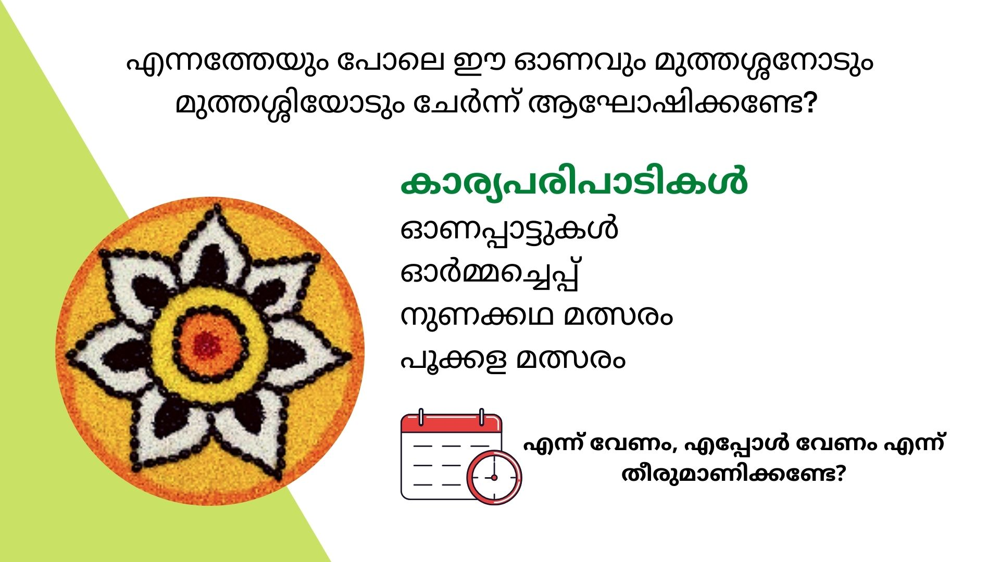

In the 2015 movie [The Intern](https://en.wikipedia.org/wiki/The_Intern_(2015_film)), Robert De Niro plays Ben Whittaker, who becomes an intern at an online company at the age of 70. In the _video cover letter_ that has to be submitted for consideration of the company, Ben gives a glimpse into his life, and his reasons for applying to become an intern. Ben, the 70 year old widower, stays alone in his home. He feels that even the occasional visits to his son's home is "probably relying on them way more than he should". May be it's the Indian in me - but I cannot fathom letting my parents or grandparents stay alone, especially at that age. 

### Our Big Fat Indian Wedding

When Chandni and I started discussing about getting married, we had to come to certain common understanding. We both wanted to avoid all religious ceremonies, and do only things both of us could do (for e.g. we didn't have _thaali_ or _mangal sutra_ because I was not ready to get one tied around my neck :wink:). We also agreed that gaudy display of gold or ornaments was not the way to go. To our surprise, our parents came around and agreed to these ideas rather quickly. The one area we couldn't extract any concession from our parents - number of invited guests. Together with both the functions (one each in Ernakulam and Trivandrum), our wedding had more than 2500 guests! On the one hand, we would've preferred a considerably smaller number of invitees - our closest friends and family. On the other hand, this was also an occasion for our parents to renew contact with a lot of their friends, and family members who stay far away. In a way, our wedding was a big reunion for our parents - family, school, college, and work! 

### Why am I writing about all this now?

Onam is upon us. Chandni has started putting [_pookkalam_](https://twitter.com/chandni_ias/status/1296998473951113216?s=20) diligently. We plan to make _sadhya_ next Sunday and eat it on banana leaf. Already plans are afoot to host several Onam Special Zoom Calls with family and friends, with traditional games. Away from home, we are trying to hold on to our cultural roots. Many of you may wonder why an atheist like me is celebrating Onam. I no longer see it as a religious festival - but a community festival - an occasion for our near and dear to spend quality time together. The pandemic has upset everyone's plans to be physically near their loved ones. However, by tugging on to some things from our childhood makes us feel closer than any video call could. 

### We survive when we are together!

This brings me back to The Intern. I do not want to be 70 years old and not near my loved ones. I hope I get to do that. When the body starts disobeying the mind, and the mind starts disobeying our will, I don't want to be alone. The only reason that I haven't gone completely crazy being stuck inside the last 5 months is because I have my dear wife with me, and the magic of internet that keeps me e-close to my favourite people in the world. I hope everyone finds their cocoon of love and never grow out of it. 