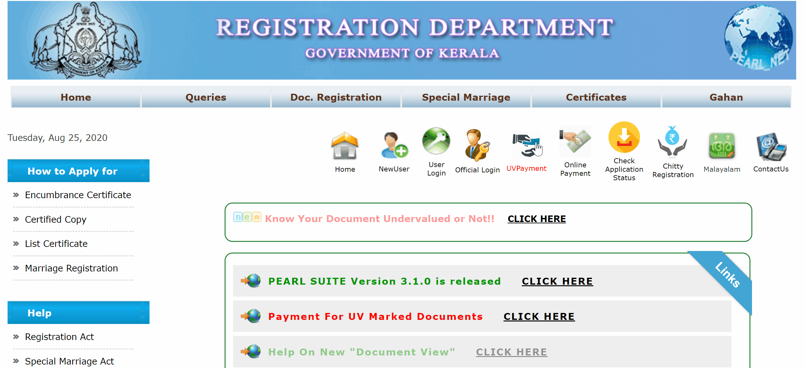
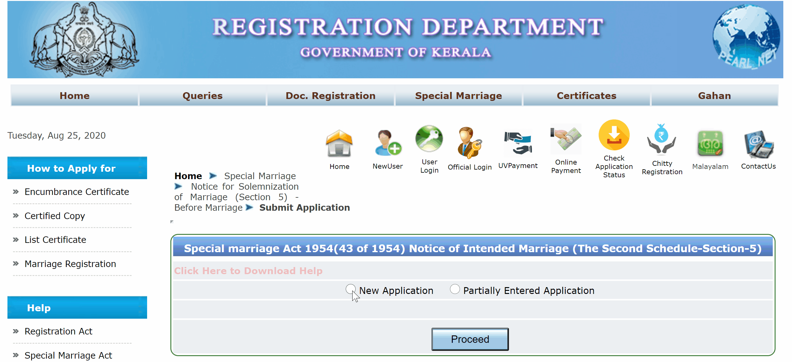
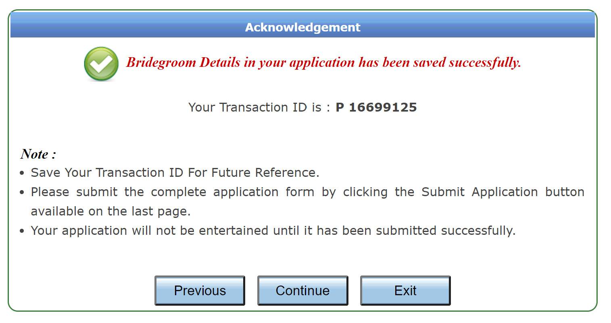
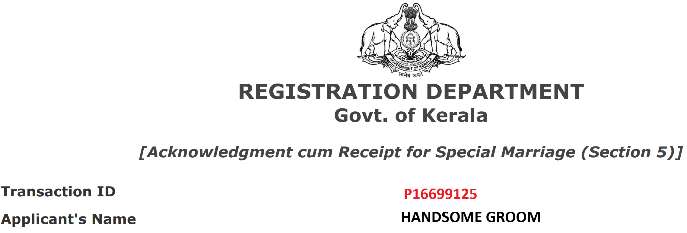

### Basic Steps

The basic steps involved in registering your marriage is as follows:

1. Give notice of the intent to get married
2. Wait for 30 days
3. Collect marriage certificate

Congratulations! You are now married. Let's now take a detailed look at the steps. Kindly note that I've written this with Kerala in mind. The specifics may vary but the procedure is same throughout India. (Read the guide completely once before attempting it. There are documents and certain information that has to be readied).

#### Step 1: Notice for Solemnization of Marriage (Section 5) - Before Marriage

1. Go to the website of the [Registration Department, Government of Kerala](http://keralaregistration.gov.in/pearlpublic/)
2. Under "Special Marriage", select _Notice for Solemnization of Marriage (Section 5) - Before Marriage_ and _Submit Application_

3. Click on "New Application". 

4. Fill out the details of the _groom_ in the application form
   1. Select Sub-Registrar Office: You have to choose the sub-registrar office to receive your marriage certificate from. Choose carefully (Check point no. 3 below). 
   2. ID Requirement: Any one of Aadhar, Driving License, Voter ID, Electoral ID, Passport, Ration Card etc. would suffice. **Aadhar is not mandatory**. 
   3. Residence requirement: Either the bride or the groom should **reside in any of the villages that comes under the selected Sub-Registrar Office**

5. Click proceed. You'll get a transaction ID. Keep this safe. 

6. Click continue. Fill out the details of the bride. 
7. Click proceed to go to the payments page. Make the payment (INR 100).
8. Print and save a copy of the acknowledgement receipt. 

Congratulations! You have successfully given the notice!

#### Step 2: Wait for 30 days

Kindly note that you have only given the notice to get married. **You are not legally married yet**. The sub-registrar offices, under who's jurisdiction both your homes comes under, will place a copy of your notice on a public board. (FYI: Till recently these notices were also put up online, which was used by some inconsiderate jerks of the highest order to [bully inter-faith couples](https://www.thenewsminute.com/article/kerala-interfaith-couples-harassed-right-wing-vigilantes-using-marriage-notices-129053). The practice was [stopped](https://www.thehindu.com/news/national/kerala/e-notice-for-marriage-stopped-due-to-privacy-issues/article32198665.ece) after an outcry.) If no objections are received within 30 days, you are free to go and solemnize your marriage, and collect the marriage certificate from the chosen sub-registrar office. 

#### Step 3: Solemnization of Marriage 

Any day after the expiry of the 30 day notice period (and before 90 days), visit the chosen sub-registrar office. You have to bring along with you the following. 

1. India Non-Judicial Stamp Paper worth INR 500 to print your marriage certificate 
2. Original (and copies) of age proof and address proof (both bride's and groom's)
3. If the address on the ID document is *not* the same as the present address, a separate address proof
4. Three (3) witnesses, their original ID cards and copies
5. Acknowledgement receipt

The staff at the sub-registrar office will verify all the documents above. They'll print the marriage certificate. The bride and the groom, and the three witnesses should now sign on the marriage register in the presence of the _marriage officer_ or any officer designated for the purpose. Finally, the certificate will be signed by the officer. Ensure that the seal of the office is affixed on the certificate. 

#### Congratulations! 

You are now legally married. Keep the certificate somewhere safe, and take a few photocopies for any future use. While I've used Kerala as an example, the broad procedure remains the same across the country. For e.g., in New Delhi, the marriage is solemnized in the office of the Sub Divisional Magistrate. Readers, if there are any inadvertent errors in the guide above, kindly let me know below in the comments. 

