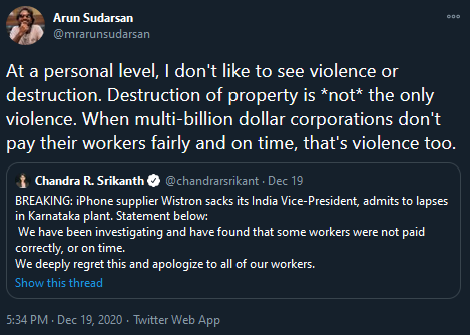

### The Wistron Saga

Recently, workers at an Apple manufacturing plant in Karnataka `went on a rampage`. [Link to video](https://twitter.com/TOIBengaluru/status/1337615298761912321?ref_src=twsrc%5Etfw%7Ctwcamp%5Etweetembed%7Ctwterm%5E1337615298761912321%7Ctwgr%5E%7Ctwcon%5Es1_&ref_url=https%3A%2F%2Fwww.theverge.com%2F2020%2F12%2F19%2F22190608%2Fapple-labor-violation-wistron-riot-india-probation) The initial reactions were predictable - 

1. It affects India's `image` as a global manufacturing hub at the time the Prime Minister is trying to give a red carpet
2. Communists are behind it
3. This is why good things can't happen in India
4. Regulations are bad

Of course, as the investigations progressed, it became amply clear that Wistron, the contractor who was operating the plant had engaged in exploitation of its workers. 

1. Most of them were contractual workers
2. They were not paid for 3-4 months
3. No overtime pay
4. Middlemen skimming their already meagre wages
5. Harsh working conditions

Apple has decided to put Wistron on [probation](https://www.theverge.com/2020/12/19/22190608/apple-labor-violation-wistron-riot-india-probation), and Wistron themselves have [admitted to several lapses](https://twitter.com/chandrarsrikant/status/1340205614484504576?s=20), going ahead and removing their India VP, and promising to institute changes. 

 ### The Unseen Violence

So I [tweeted this](https://twitter.com/mrarunsudarsan/status/1340266783115120641?s=20), and someone replied that it's not violence, it's a `violation`. Sure, they were violating rules and regulations meant to protect workers. However, what's the effect of the violation? Imagine going without salary for 3-4 months after putting in regular and overtime during a pandemic? Is that not violence? With thousands of people dependent on this income to put food on their plates, how can we not empathise with their condition? Again, I'd have happily taken a peaceful solution to this than what it ended up being. Was that an option? 

### Final thoughts

Our obsession with physical destruction of property as opposed to the destruction of lives and livelihood tells something about where we see value. Thousands of people can be systemically oppressed - no problem. A few cars are smashed - OMG the world has ended. Let this incident be a reminder that unseen violence is violence too. 